

  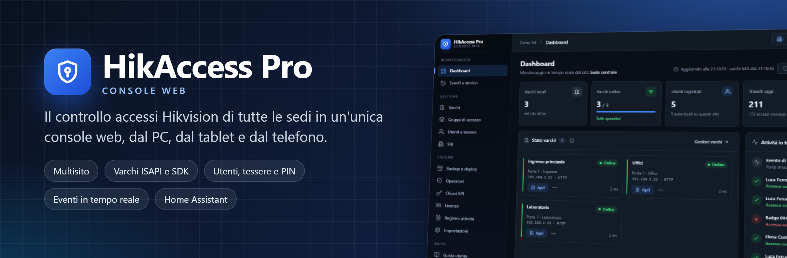

  
  
  
  
  

  <a href="https://github.com/brn78/HikAccess-Pro-Web/releases/latest"><b>⬇️ Scarica il setup</b></a>
  &nbsp;·&nbsp;
  <a href="docs/guida-utente.md"><b>📖 Guida utente</b></a>
  &nbsp;·&nbsp;
  <a href="#-versione-gratuita-e-licenza"><b>🔑 Licenza</b></a>
  &nbsp;·&nbsp;
  <a href="#-domande-frequenti"><b>❓ Domande frequenti</b></a>

---

**HikAccess Pro Web** gestisce il controllo accessi **Hikvision** di una o più sedi da un'unica console web: varchi,
gruppi di accesso, utenti con tessere Mifare e PIN, comandi delle porte, monitoraggio in tempo reale e storico degli
eventi. Si installa su un PC o un server Windows della rete, gira come servizio e si usa da qualsiasi browser, dal PC,
dal tablet o dal telefono, con account personali e ruoli.

Funziona anche su reti isolate, senza Internet e senza abbonamenti cloud: configurazione ed eventi restano sul tuo server.

  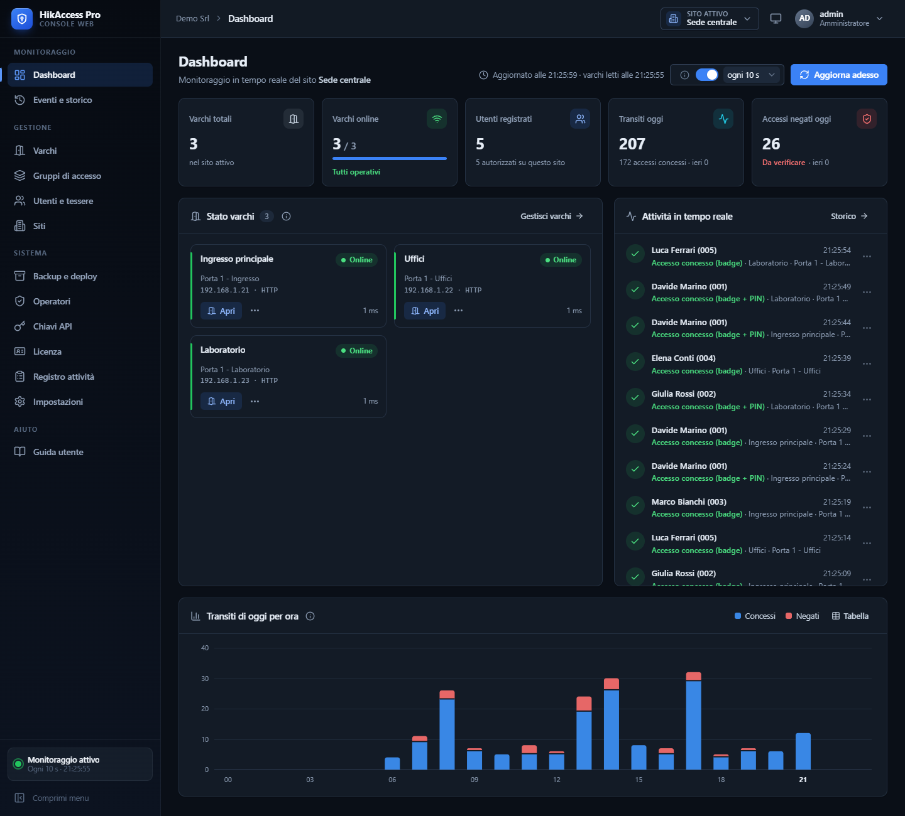

## ✨ Funzionalità

<table>
<tr>
<td width="50%" valign="top">

**🏢 Multisito** 
Più sedi in una sola console, ognuna con i suoi varchi e gruppi di accesso; gli utenti sono unici per tutto l'impianto.

**🚪 Varchi Hikvision** 
Terminali e controller via HTTP/ISAPI oppure con l'SDK Hikvision sulla porta 8000, anche multi-porta (per esempio i
DS-K2604). Apertura, chiusura, sblocco e blocco permanente, orologio, diagnostica.

**🪪 Utenti, tessere e PIN** 
Anagrafica completa, più tessere per persona, validità e gruppi. Il badge si legge dal lettore del varco, e
*Identifica badge* dà un nome alle tessere sconosciute. Le tessere tolte vengono revocate subito su tutti i varchi.

**📊 Monitoraggio in tempo reale** 
Il server controlla i varchi di continuo, anche con la console chiusa: dashboard, accessi negati, storico degli eventi
con ricerca ed esportazione CSV.

</td>
<td width="50%" valign="top">

**👥 Operatori e sicurezza** 
Account personali con ruoli (amministratore, operatore, sola lettura), verifica in due passaggi, blocco dei tentativi
errati e registro attività di ogni operazione.

**🏠 Home Assistant e domotica** 
Servizio REST con chiavi API per aprire i varchi da Home Assistant o da altri sistemi, con varchi consentiti e
scadenza per ogni chiave. *Con licenza.*

**🌐 Accesso da fuori** 
Pubblicazione tramite un proxy HTTPS, per esempio KeenDNS dei router Keenetic, con il riconoscimento dei proxy
attendibili.

**⚙️ Pensato per il server** 
Servizio di Windows con avvio automatico e icona di stato, backup e ripristino, invio di tutti gli utenti a tutti i
varchi, aggiornamento dalla console.

</td>
</tr>
</table>

## 🖼️ Uno sguardo alla console

<table>
<tr>
<td width="50%" align="center">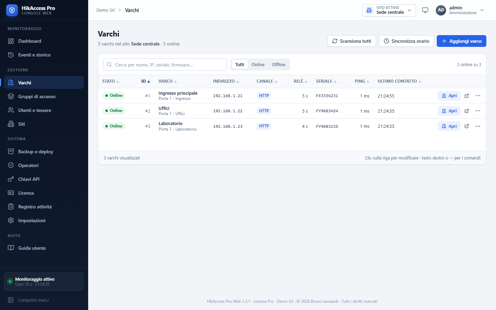 <b>Varchi</b>: stato, canale, seriale e comandi</td>
<td width="50%" align="center">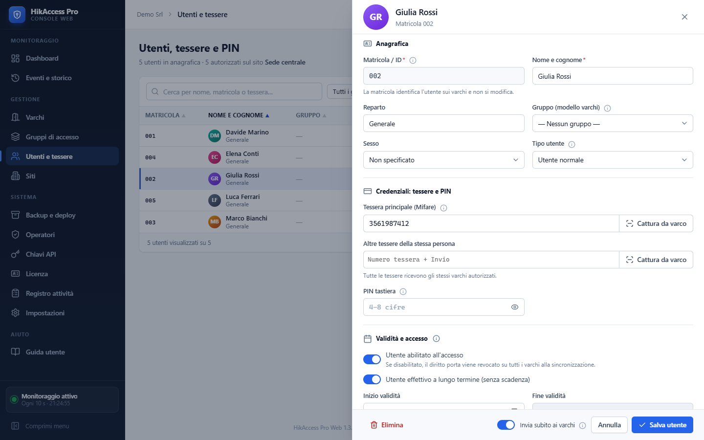 <b>Utenti e tessere</b>: la scheda della persona</td>
</tr>
<tr>
<td align="center">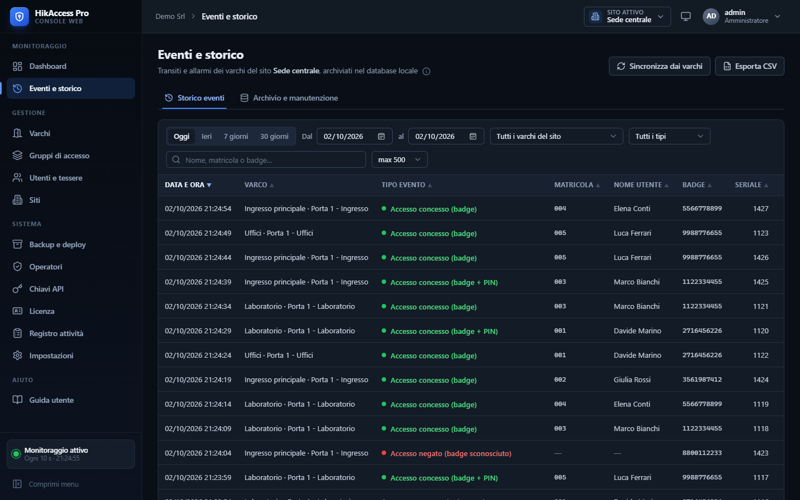 <b>Eventi e storico</b>: filtri, ricerca ed esportazione</td>
<td align="center">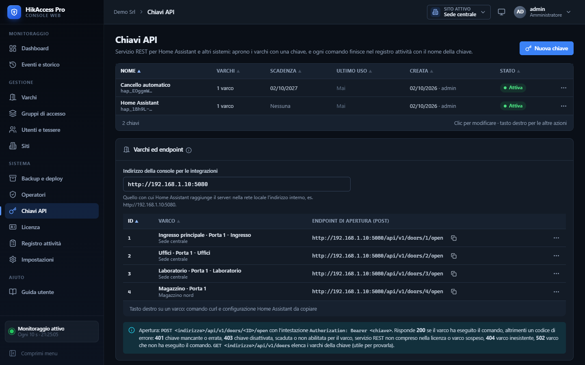 <b>Chiavi API</b>: endpoint pronti per Home Assistant</td>
</tr>
<tr>
<td align="center">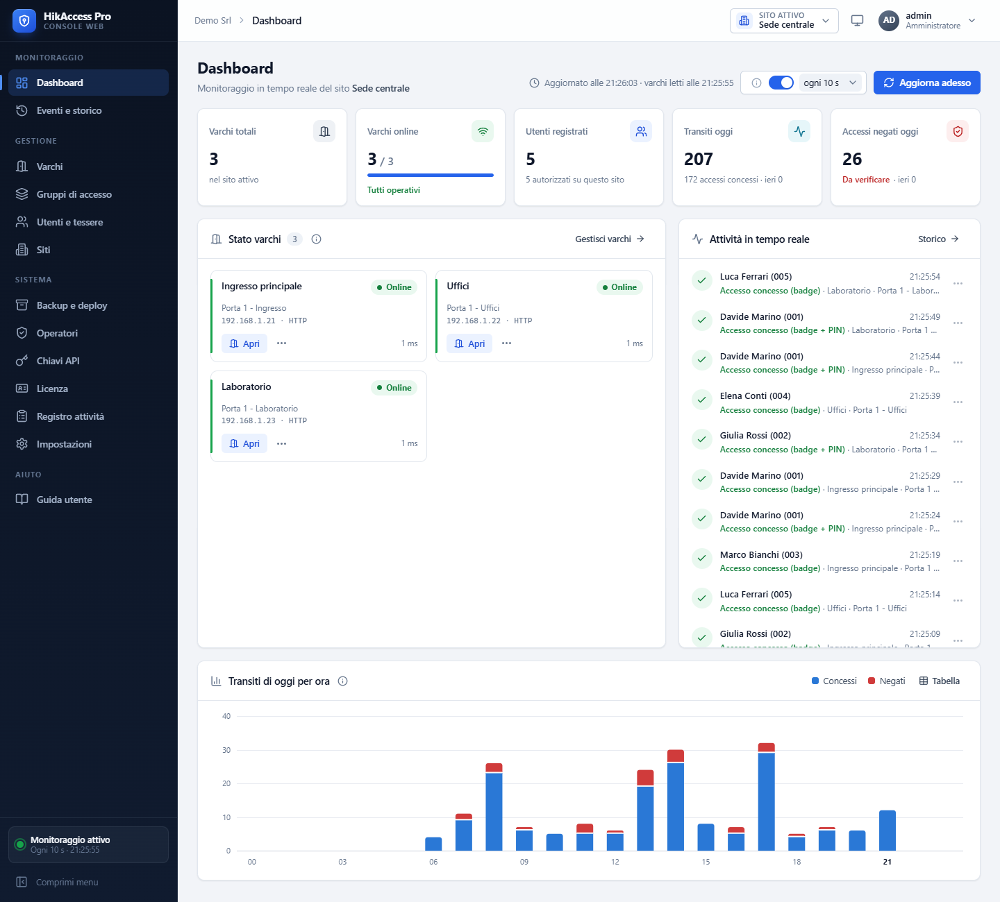 <b>Tema chiaro o scuro</b>, anche automatico</td>
<td align="center">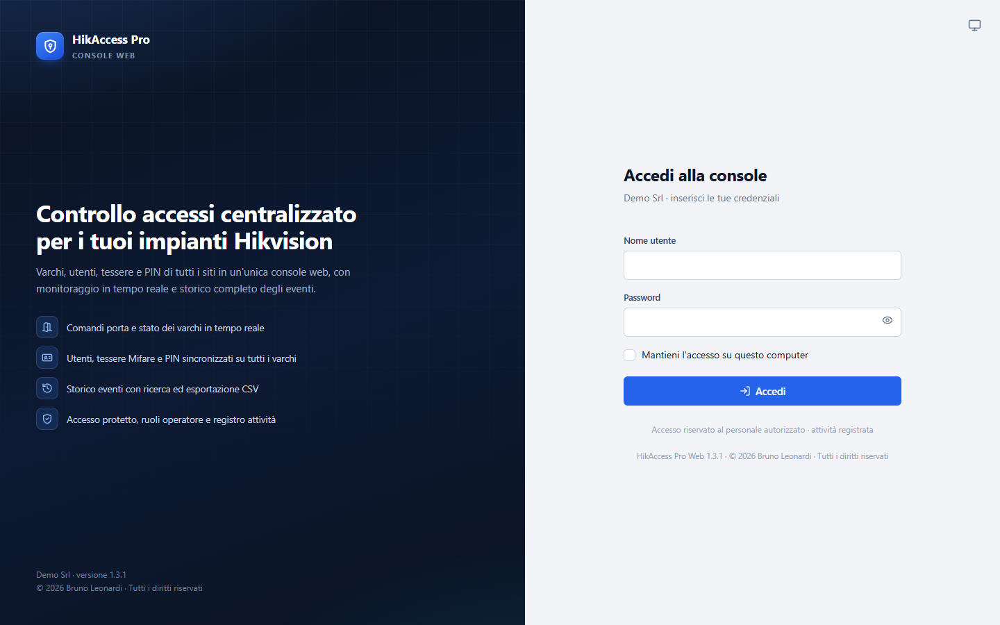 <b>Accesso protetto</b>, con verifica in due passaggi</td>
</tr>
<tr>
<td align="center">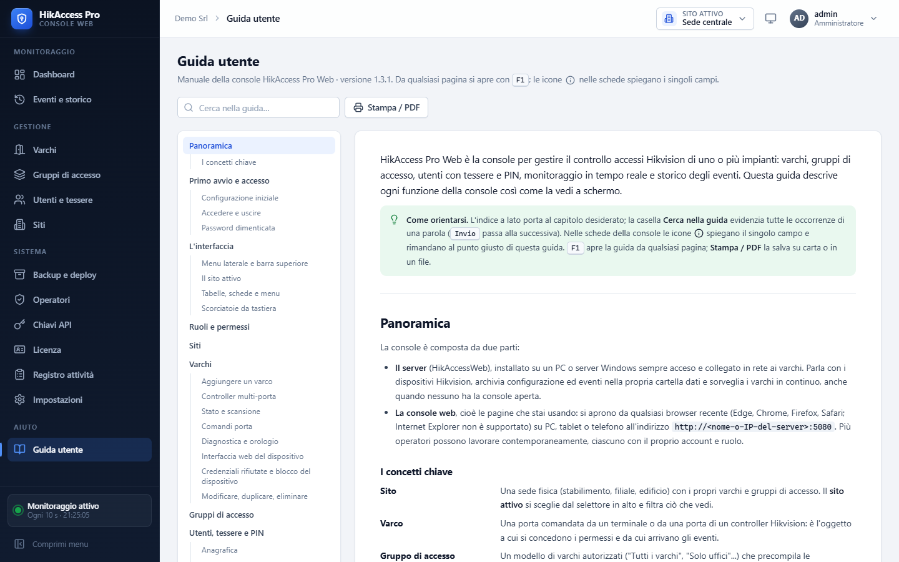 <b>Guida integrata</b>: <kbd>F1</kbd> da qualsiasi pagina</td>
<td align="center">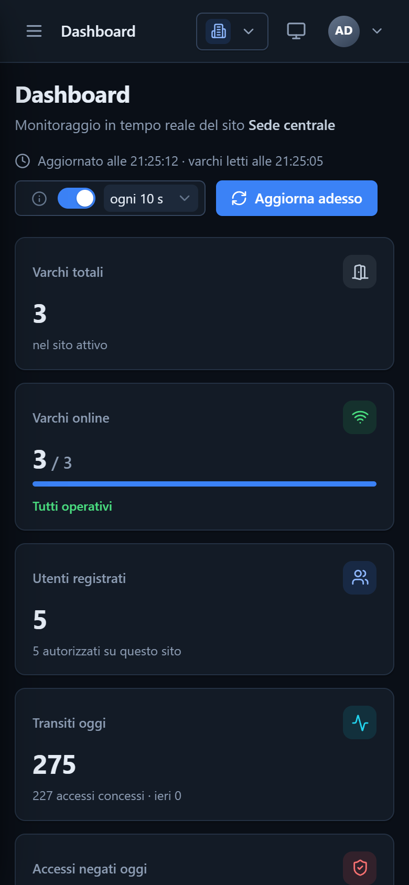 <b>Anche dal telefono</b></td>
</tr>
</table>

## ⬇️ Download

Scarica **`HikAccessWeb-<versione>-Setup.exe`** dalla pagina
[Releases](https://github.com/brn78/HikAccess-Pro-Web/releases/latest). Il setup contiene tutto il necessario, compreso
il runtime .NET: non serve installare altro.

## 💻 Requisiti

| | |
|---|---|
| **Server** | Windows 10 o 11, oppure Windows Server 2016, 2019, 2022 o 2025, a 64 bit, sempre acceso e in rete con i varchi |
| **Varchi** | Terminali e controller di controllo accessi Hikvision raggiungibili via HTTP/ISAPI (porta 80) oppure SDK (porta 8000) |
| **Postazioni** | Un browser recente (Edge, Chrome, Firefox, Safari) su PC, tablet o telefono |

## 🚀 Installazione in quattro passi

1. **Esegui il setup sul server** come amministratore: scegli la porta della console (predefinita 5080) e, se vuoi, crea
   subito l'account amministratore. Il setup installa il servizio di Windows, apre la porta nel firewall e controlla
   che la console risponda.
2. **Apri la console** da qualsiasi PC della rete: `http://<nome-o-IP-del-server>:5080`.
3. **Aggiungi i varchi** da *Varchi → Aggiungi varco*: indirizzo IP, utente e password del dispositivo.
4. **Carica gli utenti**: riceverli dai varchi o inserirli a mano; tessere e permessi arrivano da soli ai dispositivi.

Per aggiornare basta caricare il nuovo setup da *Impostazioni → Aggiornamento del programma*: dati e account restano.
Tutti i dettagli sono nella [guida utente](docs/guida-utente.md#server).

## 🔑 Versione gratuita e licenza

HikAccess Pro Web si usa **gratis e senza scadenza** con un impianto piccolo. Per più sedi o varchi, o per collegare
Home Assistant, serve una licenza.

| | Versione gratuita | Con licenza |
|---|:---:|:---:|
| Siti | 1 | secondo la licenza, anche illimitati |
| Varchi | 2 | secondo la licenza, anche illimitati |
| Utenti, tessere, PIN, gruppi, eventi, operatori, backup, accesso da fuori | ✓ | ✓ |
| Servizio REST per Home Assistant (chiavi API) | — | ✓ |
| Scadenza | nessuna | nessuna, oppure a tempo (per esempio la prova di 30 giorni) |

**Come si attiva**

1. Nella console apri **Sistema → Licenza**: in alto c'è il **codice macchina** del server.
2. Compila **Richiedi l'attivazione** e premi **Scrivi l'email**: la richiesta parte già pronta, con il codice macchina
   e i dati del server. Si può chiedere anche una **prova gratuita di 30 giorni** con tutte le funzioni.
3. Incolla la **chiave di attivazione** ricevuta (inizia con `HAP1-`) e premi **Attiva**: i nuovi limiti valgono subito,
   senza reinstallare.

La chiave vale solo per il server per cui è stata emessa. Se la licenza scade si torna alla versione gratuita senza
perdere nulla: i varchi in più restano configurati ma sospesi, e la revoca delle tessere li raggiunge comunque.

  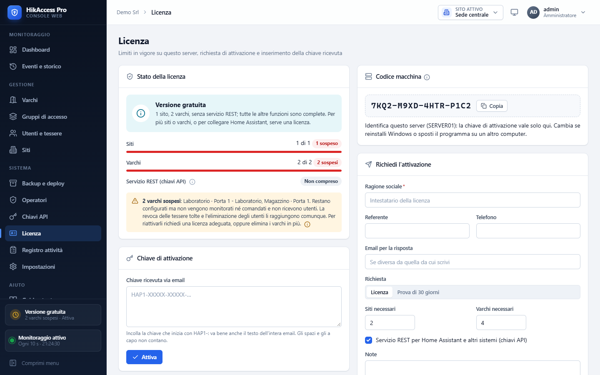

## 📖 Guida utente

La **[guida utente completa](docs/guida-utente.md)** descrive ogni pagina della console, dall'installazione alla
risoluzione dei problemi. È la stessa che si apre nella console con <kbd>F1</kbd>, con l'indice, la ricerca e la stampa
in PDF.

## 🔒 Sicurezza in breve

- Accesso con password e ruoli, **verifica in due passaggi** con un'app di autenticazione e browser di fiducia.
- Blocco dei tentativi errati, sessioni che scadono per inattività, cookie protetti.
- Le password dei varchi non arrivano mai al browser; quelle degli operatori sono salvate solo come impronta.
- **Registro attività** di accessi, comandi e modifiche, esportabile in CSV.
- Nessun servizio cloud: configurazione ed eventi restano sul server.

## ❓ Domande frequenti

<b>Quali dispositivi Hikvision posso usare?</b>

 
I terminali e i controller di controllo accessi Hikvision raggiungibili in rete via HTTP/ISAPI, la gestione «a
persone» con nome, tessere, PIN e validità, oppure con l'SDK Hikvision sulla porta di servizio 8000, come fa
iVMS-4200: per esempio i controller DS-K2604 di prima generazione. Nei controller multi-porta si crea un varco per
ogni porta.

<b>Se il server è spento, le porte si aprono ancora?</b>

 
Sì. Tessere, PIN e permessi sono memorizzati nei dispositivi, che funzionano da soli. Il server serve a gestirli e a
raccogliere gli eventi: quando torna acceso recupera anche i passaggi avvenuti nel frattempo.

<b>Serve una connessione a Internet?</b>

 
No. Server e varchi lavorano nella rete locale. Internet serve solo se vuoi usare la console da fuori, tramite un proxy
HTTPS o una VPN, e per inviare la richiesta di attivazione.

<b>Posso provare la versione completa?</b>

 
Sì: dalla pagina <b>Licenza</b> scegli <b>Prova di 30 giorni</b> nella richiesta. Alla scadenza la console torna alla
versione gratuita senza perdere configurazione ed eventi.

<b>Cosa succede se cambio server o reinstallo Windows?</b>

 
Il codice macchina cambia, quindi serve una chiave nuova: dalla pagina <b>Licenza</b> del nuovo server invia una
richiesta indicando nelle note che si tratta di un trasferimento.

<b>Come si aggiorna?</b>

 
Da <b>Impostazioni → Aggiornamento del programma</b> carichi il nuovo setup e confermi con la tua password: il
servizio si ferma per circa un minuto e la console si ricarica da sola. In alternativa si esegue il nuovo setup sul
server. Dati, account e licenza restano.

## 📬 Contatti

Licenze, prove e assistenza: **b.leonardi78@gmail.com**. La richiesta di attivazione si prepara da sola dalla pagina
**Licenza** della console.

---

  © 2026 Bruno Leonardi · Tutti i diritti riservati. 
  Hikvision è un marchio dei rispettivi proprietari. HikAccess Pro Web è un prodotto indipendente, non affiliato a Hikvision. 
  Le immagini mostrano dati dimostrativi.

